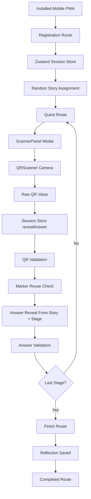

# Architecture

## High-Level Flow

## Layer Responsibilities

| Layer | Files | Responsibility |
| --- | --- | --- |
| UI layer | `src/routes/*`, `src/components/*` | Render screens, collect input, open scanner modal, show dialog feedback. |
| State layer | `src/stores/session.store.ts`, `src/stores/ui.store.ts` | Own session lifecycle, persisted gameplay state, global dialog state. |
| Data layer | `src/data/quests.json`, `src/data/qrs.ts` | Static stories, quests, answers, QR marker IDs, QR game code. |
| Utility/domain layer | `src/lib/game.ts`, `src/lib/qr.ts`, `src/lib/story.ts`, `src/lib/router-guard.ts` | Game calculations, QR parsing/validation, story lookup, route protection. |
| PWA layer | `vite.config.ts`, `src/lib/pwa.ts`, `src/lib/pwaDetection.ts`, `src/hooks/usePWAInstall.ts` | Manifest, service worker registration, install prompt handling, standalone/mobile detection. |

## UI Layer

React components are mostly rendering surfaces. Important examples:

- `src/routes/register.tsx` renders the registration form and calls `startSession`.
- `src/routes/quest.tsx` renders the active quest and calls `revealAnswer` and `completeStage`.
- `src/routes/finish.tsx` renders the completed story and calls `saveReflection`.
- `src/components/custom/ScannerPanel.tsx` manages scanner modal UI states.
- `src/components/custom/QRScanner.tsx` owns camera access and returns raw QR values only.

## State Layer

The main state boundary is `useSessionStore`.

It exposes high-level actions:

- `startSession(name, course)`
- `revealAnswer(rawQrValue)`
- `completeStage()`
- `unlockFinish()`
- `saveReflection(value)`
- `reset()`

The quest route does not directly mutate `usedQRs` or `currentStage`.

## Data Layer

Stories are stored in `src/data/quests.json`. Each story contains:

- `story_title`
- `full_story_after_completing_quest`
- `quests[]`

Each quest contains:

- `sequence`
- `riddle`
- `answer`

QR marker definitions are stored in `src/data/qrs.ts`. The current game code is `MWQ`.

## Utility Layer

`src/lib/qr.ts` parses and validates QR payloads.

`src/lib/game.ts` provides:

- current story lookup from session
- current quest lookup from session
- current answer lookup from session
- answer validation
- marker reuse checking
- quest progress calculation

`src/lib/router-guard.ts` protects routes based on `session.phase`.

## PWA Layer

`vite-plugin-pwa` generates the manifest and service worker. The app uses:

- `display: "standalone"`
- `orientation: "portrait"`
- `navigateFallback: "/index.html"`
- Workbox precaching for build assets
- runtime caching for image assets and Google font stylesheet requests

At runtime, `src/routes/__root.tsx` blocks access unless the device is mobile and the app is running in standalone mode.
