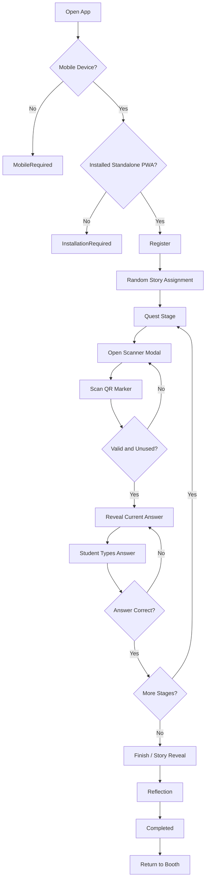

# Game Flow

## Student Journey



## 1. Installation Gate

The root route component (`src/routes/__root.tsx`) controls access before any gameplay route renders.

Current checks:

1. `isMobileDevice()`
2. `isStandalone()`

If the device is not considered mobile, the app renders `MobileRequired`.

If the device is mobile but not running as an installed standalone PWA, the app renders `InstallationRequired`.

Only installed mobile PWA sessions can access the routed gameplay.

## 2. Registration

Route: `/register`

Component: `src/routes/register.tsx`

The student enters:

- name
- course

On submit, the route calls:

```ts
startSession(name, course)
```

The store creates a `PlayerSession` with:

- generated `id`
- submitted name and course
- random `storyId`
- `currentStage: 0`
- empty `usedQRs`
- empty `reflection`
- `phase: "quest"`

The UI then navigates to `/quest`.

## 3. Story Assignment

Story assignment is local and random.

`startSession` calls `getRandomStory()` from `src/lib/story.ts`, which chooses a story index from `src/data/quests.json`.

The selected story is stored as `session.storyId`.

## 4. Quest Phase

Route: `/quest`

The quest page gets its display data from `useGame()`:

- `session`
- `story`
- `quest`
- `progress`

`useGame()` derives these values from the current persisted session. The route renders:

- current story title
- quest progress
- current riddle
- scan button
- answer input after a successful scan

## 5. QR Scan

The student taps `Scan QR Marker`, which opens `ScannerPanel`.

`ScannerPanel` renders `QRScanner`, which activates the environment camera and returns only the raw QR string.

The raw QR string is passed back to `QuestPage.handleScan`, which calls:

```ts
revealAnswer(rawQrValue)
```

## 6. Answer Reveal

`revealAnswer` validates the QR payload and marker reuse. If valid and unused, it stores the marker ID in `usedQRs`.

The quest page then reveals:

```ts
quest.answer
```

This answer comes from the assigned story and current stage. It does not come from the QR payload.

## 7. Answer Submission

The student types the revealed answer into `AnswerInput`.

`QuestPage.handleAnswer` calls:

```ts
validateAnswer(session, answer)
```

Validation is case-insensitive and trims whitespace.

If incorrect, `GameDialog` shows an error.

If correct, the route calls:

```ts
completeStage()
```

## 8. Stage Transition

`completeStage` increments `currentStage`.

If there are more quests, the session remains in:

```ts
phase: "quest"
```

If the final stage is complete, the session becomes:

```ts
phase: "finish"
```

The quest page navigates to `/finish` for the final-stage case.

## 9. Finish and Reflection

Route: `/finish`

The page shows:

- final story text from the assigned story
- reflection textarea
- complete button

On submit, it calls:

```ts
saveReflection(reflection)
```

This stores the reflection and changes:

```ts
phase: "completed"
```

The page then navigates to `/completed`.

## 10. Completion

Route: `/completed`

The final screen congratulates the student and instructs them to return to the booth for a stamp.
