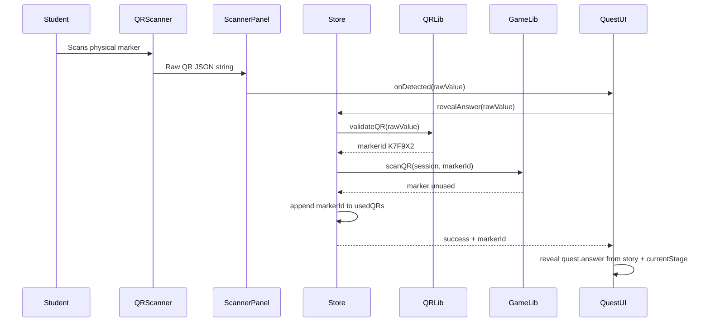

# QR System

## Core Rule

QR codes do not contain answers.

Each QR code only identifies a physical marker. The application determines the answer from:

```text
assigned story + current stage
```

This allows the same five physical QR markers to work for every student, every story, and every stage.

## QR Payload

The scanner expects the QR code to contain a JSON string:

```json
{
  "game": "MWQ",
  "marker": "K7F9X2"
}
```

Fields:

| Field | Meaning |
| --- | --- |
| `game` | Game identifier. Current valid value is `MWQ`. |
| `marker` | Physical marker ID. Must match one of the IDs in `src/data/qrs.ts`. |

## Current Marker List

Defined in `src/data/qrs.ts`.

| Marker ID | Label |
| --- | --- |
| `K7F9X2` | Marker 1 |
| `P4M8ZT` | Marker 2 |
| `V9Q3LK` | Marker 3 |
| `H6R2WD` | Marker 4 |
| `N8C5YA` | Marker 5 |

## Types

Defined in `src/types/qr.ts`.

```ts
export interface QRPayload {
  game: string;
  marker: string;
}

export type QRScanResult =
  | {
      success: true;
      markerId: string;
    }
  | {
      success: false;
      reason: "invalid" | "already-used" | "no-session" | "not-quest";
    };
```

## Parsing

`parseQR(value)` in `src/lib/qr.ts`:

1. Parses the raw scanned value as JSON.
2. Confirms `payload.game` is a string.
3. Confirms `payload.marker` is a string.
4. Trims both values.
5. Returns `QRPayload` or `null`.

Invalid JSON or missing fields produce `null`.

## Validation

`validateQR(value)` in `src/lib/qr.ts`:

1. Calls `parseQR`.
2. Rejects invalid parse results.
3. Checks `payload.game === QR_GAME_CODE`.
4. Checks `payload.marker` exists in `qrMarkers`.
5. Returns `{ success: true, markerId }` when valid.

## Marker Reuse Check

Marker reuse is checked in `scanQR(session, markerId)` in `src/lib/game.ts`.

If `session.usedQRs` already contains the marker ID, it returns:

```ts
{
  success: false,
  reason: "already-used"
}
```

If unused, it returns:

```ts
{
  success: true,
  markerId
}
```

## Store Integration

`revealAnswer(rawQrValue)` in `src/stores/session.store.ts` owns the full QR scan business flow:

1. Ensure a session exists.
2. Ensure `session.phase === "quest"`.
3. Validate the raw QR JSON.
4. Check marker reuse for this player.
5. Save marker ID into `session.usedQRs`.
6. Return a `QRScanResult`.

The route does not directly mutate `usedQRs`.

## Scanner Separation

`QRScanner` does not know about:

- stories
- answers
- stages
- marker reuse
- game phase

It only:

- opens the camera
- scans QR values
- debounces rapid duplicate callbacks
- returns a raw string through `onScan`
- stops camera tracks on cleanup

## Example Flow



## Duplicate Prevention

Duplicate prevention exists in two places:

| Layer | Purpose |
| --- | --- |
| `QRScanner` | Prevents rapid repeated camera callbacks from firing for the same visible QR. |
| `session.usedQRs` | Permanently prevents the same player from reusing the same marker in the current persisted session. |

Another student can still scan the same physical marker because each student has a separate local session.
